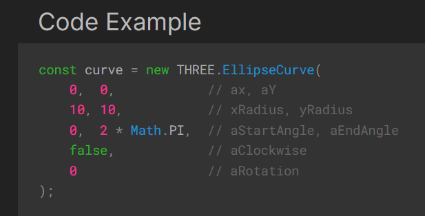
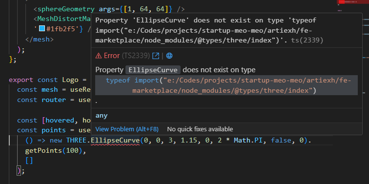

# How ThreeJS works in this repo

This is a modified version of [react-three-next-starter-template](https://github.com/pmndrs/react-three-next).

- [How ThreeJS works in this repo](#how-threejs-works-in-this-repo)
  - [**tunnel-rat**](#tunnel-rat)
  - [**Scene**](#scene)
  - [**View**](#view)
  - [Note for **View** and **Scene**](#note-for-view-and-scene)
    - [**TLDR**](#tldr)
    - [**I hate TLDR**](#i-hate-tldr)
  - [**Examples**](#examples)
  - [**@react-three/drei**](#react-threedrei)
  - [**Quirks**](#quirks)

## **tunnel-rat**

> **TLDR:** Teleportation for Components in React Fiber.

This system uses `tunnel-rat`. Anything in `<r3f.In></r3f.In>` will be rendered in `<r3f.Out></r3f.Out>` no matter where it is in the DOM.

Refer to [this github](https://github.com/pmndrs/tunnel-rat) for more information.

Contains in `/src/components/Three/Base`.

## **Scene**

Contains the `<Canvas/>` component from `react-three-fiber`. This is where the scene is rendered using `<r3f.Out></r3f.Out>`.

Contains in `/src/components/Three/Scene`.

## **View**

Contains the `<View/>` component. This is where your 3D objects are rendered using `<r3f.In></r3f.In>`.

Contains in `/src/components/Three/View`.

## Note for **View** and **Scene**

### **TLDR**

> **TLDR:** It's fucking magik.
>
> **Serious TLDR:** `<View/>` renders 3D Objects and must be a children of `<Scene/>`. One `<Scene/>` can contain multiple `<View/>`

### **I hate TLDR**

In order for `<View/>` to be rendered, it must be inside of a `<Scene/>` component. This is because `<Scene/>` is the one that renders the `<Canvas/>` component from `react-three-fiber` and `<View/>` is the one that renders the `<r3f.In></r3f.In>` component from `tunnel-rat`.

`<ThreeLayout></ThreeLayout>` is just a page wrapper with ONE `<Scene/>` component. This is to ensure that there is only one `<Canvas/>` component rendered at a time. However, you can have multiple `<View/>` components inside of `<Scene/>`.

These `<View/>` components will be rendered in the order that they are placed in `<Scene/>`. And their positions will be tracked by `tunnel-rat` and remained relative to the `<Scene/>` component.

Read the damn tunnel rat documentation.

## **Examples**

Contains examples of 3D objects that can be rendered in `<View/>`.

## **@react-three/drei**

> **TLDR:** It is dark magik written by gods.

Contains utilities components and functions from `@react-three/drei`. Refer to [this github](https://github.com/pmndrs/drei) for more information.

## **Quirks**

Type definitions are no where to be seen. Even with correct typing, sometimes it will still not be able to find the module. Hence most files have `@ts-ignore` at the top.

Document said

Typescript said

